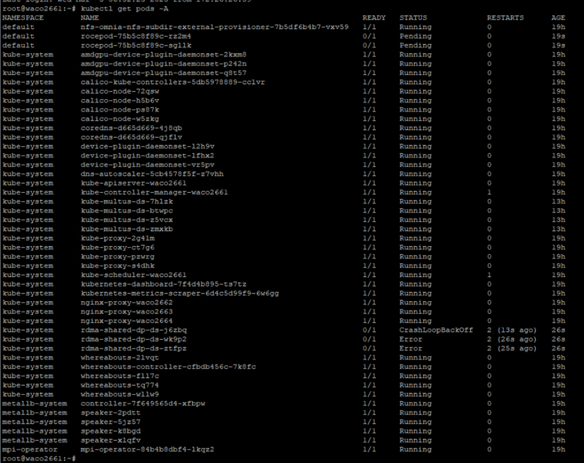

Kubernetes
============

⦾ **After successfully executing the** ``deploy_roce_plugin.yml`` **playbook on the** ``kube_control_plane`` **node, the RDMA pods goes to a CrashLoopBackOff state and the RoCE pods will be in pending state.**

**Resolution**: To resolve this issue, perform the following steps:

    1. First you need to open and edit the RDMA daemonset. To do so, use the following command: ::

        kubectl edit ds rdma-shared-dp-ds -n kube-system

    2. Add the following ``mountPath`` under the ``volumeMounts`` section: ::

        - name: pci-ids
          mountPath: /usr/share/misc/pci.ids
          readOnly: true

    3. Finally, add the following under ``volumes`` section: ::

        - name: pci-ids
          hostPath:
            path: /usr/share/misc/pci.ids
            type: File

    4. After this the RDMA and RoCE pods will come to running state as shown in the below screenshot.

    .. image:: ../../../images/roce_error_fixed.png